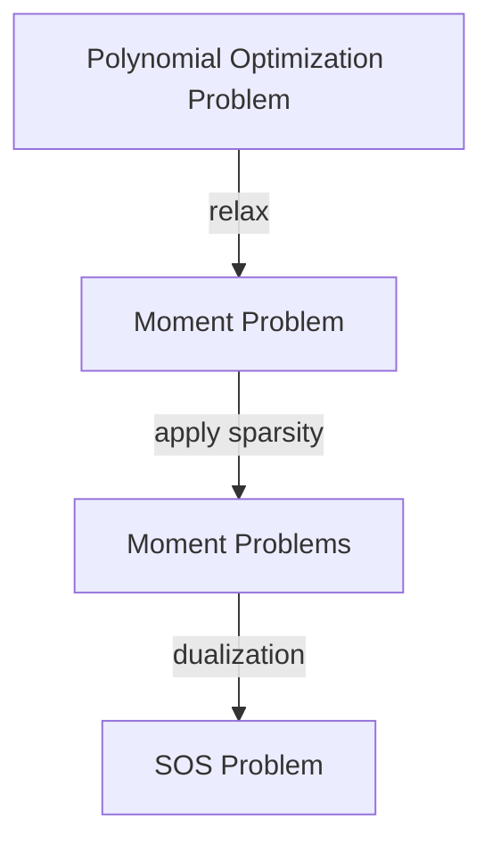

= TODOs
- [x] Remove unnecessary exports
- [x] Group Exports together in the NCTSSOS.jl file
- [x] Change some TODOs to NOTEs
- [x] Remove clique in MomentMethod
- [x] Remove all `DP` usage, just import with `using DynamicPolynomials: foo`

- [ ] Verify no un-necessary files in the PR

= API Redesign

`PolynomialOptimizationProblem` characterizes a general Polynomial Optimziation problem.

= API Naming Changes

- `sym_canon` -> `symmetric_canonalize`
- `get_ncbasis` -> `get_basis` generalized to work on commuting and non-commuting variables.

= Introduced API

-  `remove_zero_degree` removes variables with degree $0$ in a monomial. It is
required for comparison of two monomials' equality.

