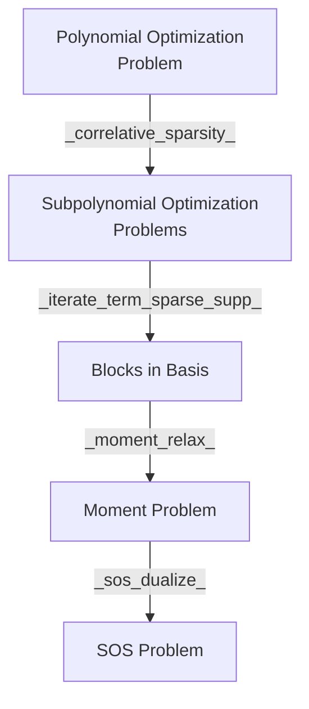

= TODOs
- [ ] Make a flowchart of work precedure
    - [ ] Procedure
        - [ ] What are the test cases and their results
        - [ ] Explain Usage
    - [ ] Key components

- [ ] Verify no un-necessary files in the PR

== File Went Over
=== Src
- [x] `pop.jl`
- [x] `solver_utils.jl`
- [ ] `moment_solver.jl`
- [ ] `sos_solver.jl`
- [x] `sparse.jl`

=== Test
- [x] `pop.jl`
- [x] `solver_utils.jl`
- [ ] `moment_solver.jl`
- [ ] `sos_solver.jl`
- [x] `sparse.jl`

= Workflow Redesign

= `pop.jl`
- Modeling of a Polynomial Optimization Problem
- `PolynomialOptimizationProblem(objective,constraint)`

= `sparse.jl`
- Analysis of Correlative Sparsity and Term Sparsity Nature of Problem
== Correlative Sparsity
`correlative_sparsity` returns `CorrelativeSparsity` with information about following information in each clique
1. Variables
2. Constraints
3. Constraints in no clique
4. Indexing basis for moment/localizing matrices

== Term Sparsity
`iterate_term_sparse_supp` returns `TermSparsity`

= `moment_solver.jl`
- Relaxation of Polynomial Optimization Problem into Moment Problem Considering Sparsity

= `sos_solver.jl`
- Dualization of Moment Problem

= API Changes
- `sym_canon` -> `symmetric_canonalize`
- `get_ncbasis` -> `get_basis` generalized to work on commuting and non-commuting variables.
- `clique_decomp`: core functionality moved to `get_correlative_graph` for better testing
- `assign_constraint` now takes a vector of vector of variables denoting cliques
and a vector of polynomials denoting constraints.
- `nctssos_higher` -> `iterate_term_sparse_supp`

= Introduced API
-  `remove_zero_degree` removes variables with degree $0$ in a monomial. It is
required for comparison of two monomials' equality.
- `sorted_unique` removes duplicate elements from a vector and sorts it.
- `sorted_union` union multiple vectors and sort the result.
- `get_correlative_graph`
- `clique_decomp` does clique decomposition on both term sparsity graph and correlative sparse graph
- `get_term_sparsity_graph`
- `term_sparsity_graph_supp`:

= Questions

== Order in Construction of Localizing Matrix
- Are $L_(bold(y)) (u^* g v)$ and $L_(bold(y)) (g u^* v)$ lead to the same relaxation?
- What is the motivation for `UInt16`

== `assign_constraint` returns pairwise non-disjoint cliques
In contrary to pp30 on Sparse Polynomial Optimization.
