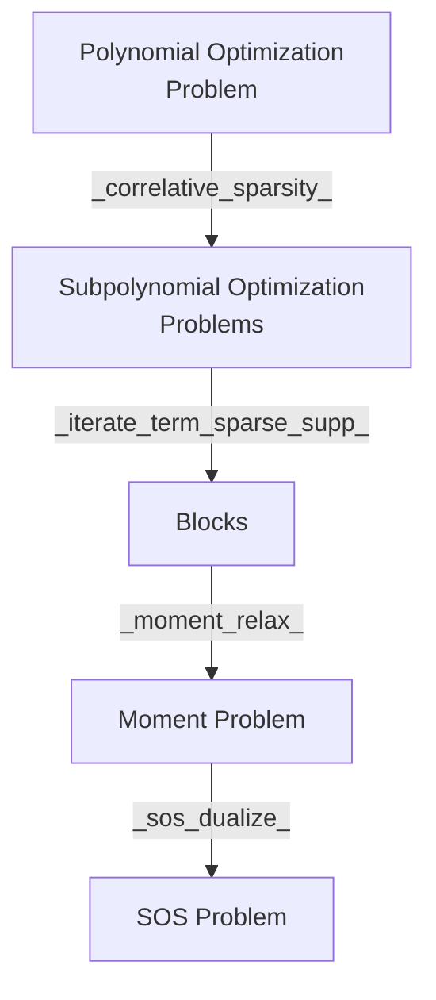

# Test Cases and Usage Example

All test cases included in the `test.jl` in `NCTSSOS` are tested.
Utilies and other helper functions are tested based on outputs of `NCTSSOS`.

## Moment Problem
- See the `CS TS Example` testcase in `test/moment_solver.jl`

## Sum of Square Problem
- See the `CS TS Example` test case in `test/sos_solver.jl`

# Features
- Minimum Eigenvalue Objectives
- Noncommuting and commuting variables (using `DynamicPolynomials.jl`)
- Moment Problem and Sum of Square Problem
- Correlative Sparsity and Term Sparsity to any order (using `CliqueTrees.jl`)

# Workflow Redesign

# Questions

Order in Construction of Localizing Matrix
- Do $L_{\mathbf{y}} (u^* g v)$ and $L_{\mathbf{y}} (g u^* v)$ lead to the same relaxation?
- What is the motivation for `UInt16`

`assign_constraint` returns pairwise non-disjoint cliques in contrary to pp30 on Sparse Polynomial Optimization.

# API Changes
- `sym_canon` -> `symmetric_canonalize`
- `get_ncbasis` -> `get_basis` generalized to work on commuting and non-commuting variables.
- `clique_decomp`: core functionality moved to `get_correlative_graph` for better testing
- `assign_constraint` now takes a vector of vector of variables denoting cliques
and a vector of polynomials denoting constraints.
- `nctssos_higher` -> `iterate_term_sparse_supp`

# TODOs
- [ ] Verify no un-necessary files in the PR
- [ ] performance benchmarking, does $C_{\alpha,j}$ get cast into dense formulation
- [ ] a set of commuting and noncommuting variables and some variables being non-commuting
- [ ] polynomial optimization problem on LJ Potential
