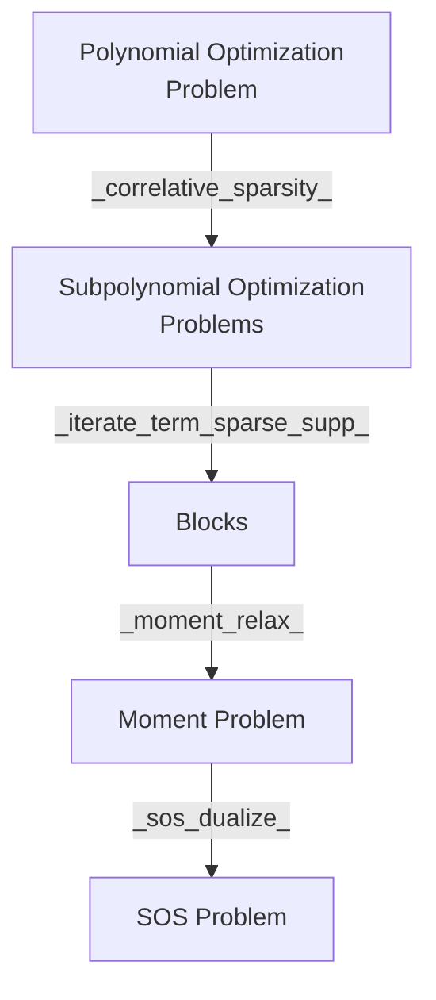

# Features
- Minimum Eigenvalue Objectives 
# TODO: trace polynomial, complex field, state polynomial, trace, variables some commutes with all and square to one
# TODO: TSSOS: another package b/c it considers a lot of traditional optimization problem
# TODO: No extension, just return cliques
- Noncommuting and commuting variables (using `DynamicPolynomials.jl`)
- Moment Problem and Sum of Square Problem
- Correlative Sparsity and Term Sparsity to any order (using `CliqueTrees.jl`)

# Workflow Redesign

# Questions

`assign_constraint` returns pairwise non-disjoint cliques in contrary to pp30 on Sparse Polynomial Optimization.

# API Changes
- `sym_canon` -> `symmetric_canonalize`
- `get_ncbasis` -> `get_basis` generalized to work on commuting and non-commuting variables.
- `clique_decomp`: core functionality moved to `get_correlative_graph` for better testing
- `assign_constraint` now takes a vector of vector of variables denoting cliques
and a vector of polynomials denoting constraints.
- `nctssos_higher` -> `iterate_term_sparse_supp`

# TODOs
- [ ] Try Rational function objective in `TSSOS.jl`