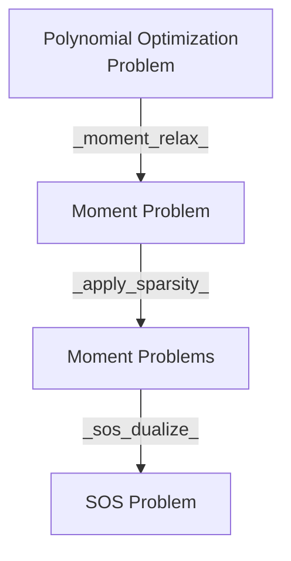

= TODOs
- [ ] Make a flowchart of work precedure
    - [ ] Procedure
        - [ ] What are the test cases and their results
        - [ ] Explain Usage
    - [ ] Key components
- [x] Remove unnecessary exports
- [x] Group Exports together in the NCTSSOS.jl file
- [x] Change some TODOs to NOTEs
- [x] Remove clique in MomentMethod
- [x] Remove all `DP` usage, just import with `using DynamicPolynomials: foo`

- [ ] Verify no un-necessary files in the PR

== File Went Over
=== Src
- [ ] `pop.jl`
- [ ] `solver_utils.jl`
- [ ] `moment_solver.jl`
- [ ] `sos_solver.jl`
- [ ] `sparse.jl`

=== Test
- [ ] `pop.jl`
- [ ] `solver_utils.jl`
- [ ] `moment_solver.jl`
- [ ] `sos_solver.jl`
- [ ] `sparse.jl`

= Workflow Redesign 

= API Naming Changes

- `sym_canon` -> `symmetric_canonalize`
- `get_ncbasis` -> `get_basis` generalized to work on commuting and non-commuting variables.
- `clique_decomp`: core functionality moved to `get_correlative_graph` for better testing

= API Input changes

- `assign_constraint` now takes a vector of vector of variables denoting cliques
and a vector of polynomials denoting constraints.

<!-- == `get_graph`
- `get_graph` -> `get_graph`
code in `nccpop.jl` and `ncupop.jl` are exactly the same
code in `trace.jl` and `complex.jl` have not been considered -->

= Introduced API

-  `remove_zero_degree` removes variables with degree $0$ in a monomial. It is
required for comparison of two monomials' equality.

= Questions

== Order in Construction of Localizing Matrix
- Are $L_(bold(y)) (u^* g v)$ and $L_(bold(y)) (g u^* v)$ lead to the same relaxation?
- What is the motivation for `UInt16`

== `assign_constraint` returns pairwise non-disjoint cliques
In contrary to pp30 on Sparse Polynomial Optimization.
